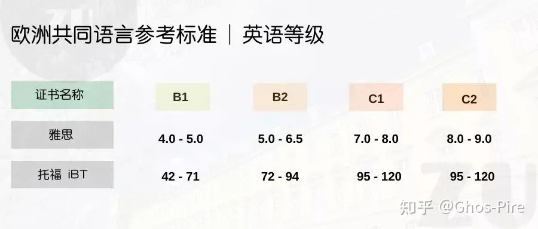

之前发布在notion上的一篇经验分享，搬移到本博客来。  

## 写在前面
本指南完全基于作者本科未毕业时申请23WS计算机方向英授硕士项目的经验，对于其他专业不一定适用，所有信息请以学校官网为准。任何拿不准的问题都强烈推荐直接写邮件询问申请项目的contact person（包括但不限于匹配度，需要材料的格式等等）。因为在我申请过程中受到了好几位象友的帮助，希望我自己的经验也能帮到正在或准备申请德国的象友。

*Escape is a mighty method to destabilise dominion.  祝大家早日肉身翻墙成功！*

## 申请前期准备

学校选拔流程规范可以参考[曼海姆](https://www.uni-mannheim.de/media/Einrichtungen/zula/Auswahlsatzungen_master/satzung_ma_mmds_en.pdf/flipbook)（每个学校每个招生的专业都一定有一个这样的Selection文件）

整个文件准备可以参考[汉堡大学IAS的wiki](https://www2.informatik.uni-hamburg.de/Info/Studium/MSc/IAS/wiki/index.php/Application:Required_documents#4._Letter_of_Motivation)

### 匹配度

这一点放在最开始是因为匹配度满足学校要求是申请德国硕士的第一道门槛，也是最需要最早准备的。匹配度达标即你所修的课程的学分在不同领域均达到了学校的学分要求。比如学校A要求你需要理论计算机至少有20**CP**，你提交的成绩单上显示的*学校**认可**是理论计算机*的课程只有15CP，那么学校极可能以”academic entry requirements not met“为理由拒绝你的申请。这个信息都会在项目的**Admission requirements**中能看到详细的。之所以强调“学校认可”是因为理论计算机这块是我个人申请过程中遇到最难匹配的部分，比如我本科上过的《数字逻辑》可能被其他学校认可，但是柏林工大就明确强调digital logic并不属于理论计算机，在匹配时就不能把这个算上。

一般来说，申请时都有一张匹配表需要填写提交，与**Admission requirements**中常常是匹配的，例如：

- 柏林工大2023WS CS Master的匹配度要求
    
    A total of 36 credit points in the fundamentals of computer science, with
    
    - 12 credit points in theoretical computer science,
    - 12 credit points in computer engineering or information technology,
    - 12 credit points in methodological-practical computer science.
    
    18 credit points in mathematics, with a minimum of 30 further credit points in computer science.
    
- [柏林工大CS Master的匹配表](https://www.static.tu.berlin/fileadmin/www/10000040/1_Studium_Lehre/1_Studienangebot/2_Masterstudiengaenge/2_M_CS/MScCS-SAF.pdf)
    
如果你是大一大二大三，决定去德国留学后第一时间确定一个梦校，详细阅读他们的招生要求，然后调整自己的选课。对于计算机方向的准备者，我建议数学和计算机的选修课都要多上一些，我申请过的Data Science专业基本对数学都有一定学分的要求，计算机的选修课也可以尽可能的**广**一些，比如网络安全/图像处理/数据挖掘等等，这门课说不定会成为你之后选择某一个专业下某个方向动机信的主要论述对象。

补充1:  是有学校或专业接受补课，即入学后再补休缺失的学分，不过我申请过程中并没有学校提供这个。

补充2: 上述的CP即学分，一般是指ECTS，计算方式是1个ECTS=30hours课上$+$课下学习时间。这和国内高校一般不大一样，比如我的本科学校就是只算上了课上时间，这样实际学分往往能换到更大的ECTS，换算公式如下：

$$
    1CP = \frac{30 \times semesterNum }{minimalCPRequest}
$$

其中semesterNum就是毕业的学期数，一般就是8，minimal CP Request就是毕业要求的最低学分，比如我的专业是160，这样算下来我的1CP$\approx$1.5 ECTS。上述换算公式是我使用的，目前还没有学校告知我说不行，不过也不代表他们认可。比如申请汉堡大学的时候他们提供的Excel自动换算之后只有1.1倍左右。上述几个数字，比如学期数，最低毕业学分，以及学分不包括课下时间这个事实（如果适用的话）最好都让教务处出局一份中英文盖章证明。

### GRE

在我申请过程中只有慕尼黑工大和亚琛工大把GRE纳入必须提交且要满足要求的申请条件，其他都是学校都是optional，我个人因为作文没到4.0且实在不想重考，就没申请这两个学校，其他学校也都没有提交GRE成绩。不过我觉得有时间和精力是可以多准备GRE的，万一改变想法不去德国了GRE成绩在其他国家的申请也是加分不少的。

### 语言（英语）

德国学校一般以欧标作为英语水平的衡量标准，大多要求B2或者C1，和托福雅思对应如下：

身边有不少申请北美的同学语言会刷到一个快满分的分数，德国这边我个人认为是够用即可，比如雅思7.0/托福96，多的时间可以用来刷GRE。  

补充1:我建议可以大三下学期再考语言，因为这样两年的有效期能保证你冬季没赶上赶夏季的升级，我拿到offer前最头疼的就是没申请上要重新考托福。

补充2:一般德国的学校只需要语言证明的电子文档，只有少部分像不伦瑞克工大才要ETS送分，这个要在官网看清楚。

### 课程描述

《课程描述》是一份向目标学校阐述你成绩单上的专业课到底是上了什么的文件，基本上所有学校都有中文版，但是有时英文版需要自己准备，在之后有的学校会要求提交。我把《课程描述》放在APS之前是因为我当时就是边准备APS边写《课程描述》的英文版，相当于顺便复习。以下是准备流程：

1. 关于课程描述的格式参考和重要性可以参考[《ABCDV 留德红宝书》](abcdv.pdf)对应章节 。推荐直接谷歌搜索“Modulhandbuch+学校+专业”，大概率能够找到想申请学校官方的课程大纲是什么样子，作为一个重要的参考。
2. 获取中文课程大纲：
i: 去学校教务官网找学部开设课程的大纲：以我们学校为例，在教务内网是有按照学部以及开设课程类型来分类的课程大纲，比如计算机学院-校选课。（找不到的话可以直接打教务电话问一下能否提供）
ii: 直接通过微信/邮件/学习通等方式向任课老师询问，老师一般都会比较乐意提供。
iii: 直接在互联网上搜索对应的课程的大纲。缺点是需要仔细核实有没有遗漏的重要知识点。
3. 翻译
我的翻译方法是直接复制到Deep L里面，然后核对英文是否翻译正确。
4. 课程分类
我的学校本身是按照专业课，选修课这样来分类，没有细分。所以我按照申请学校提供的课程核对表对学的课程进行分类。比如TU Berlin
[CS的硕士申请表](https://www.notion.so/526bf4bd036a4b42b9be4aab33b728a0?pvs=21)就将课程分成了Theoretical Computer Science， Computer Engineering or Information Technology， Methodological-Practical Computer Science等等
5. 封面盖章
这步我不清楚不同学校差异是否很大，我完成的流程是：
i. 打电话问教务说明情况：因为你们没有英文的所以我只能自己翻译
ii. 教务同意，给教学院长审核
iii. 教学院长签字，教务盖章

### APS

APS是一个针对中国和越南学生的面谈考试，目的就是判断你的成绩单是不是真的，即有没有真的去学校学到课本上的东西。主要是专业性考试+面试。APS一般是大三下学期结束就可以开始去审核部准备。（以下是我整理的我APS考完当天发的嘟文）

- 考试准备

    我是申请的计科的英面，拿零碎时间前前后后准备了小三个月大概，考完感觉自己可能一周突击一下也没问题。我是用Notion来管理所有学科，把提交送审的成绩单上的所有学科都放到表格里，每个学科有一个独立的page。 笼统复习的方法：找老师要课程大纲（我是学校教务官网就有），或者你自己看老师ppt的每一章叫什么名字；

    重要学科具体复习：直接谷歌“学科名+interview questions“，很多细的点重点的点都有。

- 申请（本条已不再适用目前APS的排队制）

    我是递交材料10个工作日就出了审核号和档案号，九月初发邮件预约考试时间，几乎是秒回邮件和你确认，然后提前14天通知具体的时间和上下午场次。

- 考试当天

    我是上午场，就四五个人，在楼下被统一带到一个候场室就是等待叫号去笔试+面试了。上楼之前就会要求所有电子设备关机，所以一定要准备纸质资料！！！~~不然会像我等一个小时无聊到数砖~~。

- 考试过程

    笔试题真的不难，非常非常基础，感觉就是学科introduction以及第一章的部分。面试我遇到的审核官也很nice，可以写写画画，英语口语不流畅也不用太担心。

### 出国交换

建议有能去国外交换的条件的都可以争取一下，抛开其他非常多的好处不谈，在申请时的Extracurricular activities里，国外学习经历的加分比例是最大的。因为德国如果是NC专业（即限制人数的专业）基本都会排名，而这个排名的打分依据除了成绩，经历中有国际交流是很有优势的。详细的打分可以看学校的选拔文件，在项目官网上应该都有。

### 实习/科研/课内项目

这三者都是你能够实际写在CV上的经历，所以一定要好好提早准备。因为我不大想走学术（至少在国内），所以科研这块我不太了解，这块我就略过。

- 实习
    
    建议找**专业相关**的**3个月或以上**的实习。我的两份实习都是在实习僧上找到的。最后结束的时候记得联系HR开一份**中英文**的实习证明（只有中文的话要公证，很麻烦）。我觉得实习是很有用的，不仅可以赚钱，也可以为自己之后万一没申请上有一个工作的退路。
    
- 课内项目
    
    就我个人经验而言，至少对于CS专业来说，把一个课内项目做好是最省时间也是好处最多的（经历的可写性，课内的成绩等等。给课内老师留下好印象之后要推荐信都方便很多）。我写到CV上的三段项目经历都是课设或者大作业。找实习的时候我也是给面试官看了我的小程序项目他直接给了我口头offer。
    

### 总结+碎碎念

德国前期的准备就是很漫长，我是大二偶然机会下，听一位去法国的学姐和我说德国工科好还没学费，就立刻开始准备去德国。接着就是大三考语言，大四开始申请，希望毕业马上能润走。总之希望申请到好学校的话，成绩和经历都是很重要的。但是我也不喜欢太功利心地去拿一个分数，抱着去提升自己+好好做的心态去做一件事一定可以得到回报。

---

## 申请中准备

### 成绩单

这里准备好中英文官网翻译文件或者公证文件就好，要提醒的一点是，如果你的中英文成绩单扫描出来密密麻麻的（像我的学校给的一样），很建议你去公证处公证一份，因为学校在check你的成绩单时很可能因为成绩单本身可读性很差而导致信息出错，比如少统计了一门课的学分。去公证处公证时也记得带上你准备好的英文参考，这样公证处的文件翻译出错几率就小很多。

### 动机信

动机信是申请中很重要的一环，是让学校了解你为什么想去该学校该专业，以及他们有什么理由选你而不选其他人，要从挑选者的角度来思考。毕我当时写的时候还没有chatgpt，语法这些都可以让AI改改。 内容可以参考[汉堡大学LOM的内容指导](https://www2.informatik.uni-hamburg.de/Info/Studium/MSc/IAS/wiki/index.php/Application:Required_documents#3._Letter_of_Motivation)，下面是我copy过来的：

This is the most important document since it accounts for 40% of your ranking score. It has to be written by yourself and in English. The maximum length is 1.5 pages (not more: the selection committee may reject your application on the grounds of the quality of your motivational letter). In your letter of motivation, you should explain your reasons to study this particular program. Your letter of motivation should answer the following questions:

- Why are you interested in the field of "Intelligent Adaptive Systems" and what parts of it are most interesting and why?
- Why is this program especially suited to complement the knowledge you already have?
- Why did you choose to study this program at Universität Hamburg?
- How does this program fit your academic and professional future goals?
- How would you avoid a cultural shock?
- Analyze the selection criteria and the IAS curriculum so that you know what else might be important to write.

The selection committee will give high ratings to letters that show you have made a deliberate choice to study IAS. You need to justify your decision well and explain how studying the IAS Master will bring you closer to your desired goals. The board is looking for students that show high motivation and have a good chance of finishing the program with a high impact on the student's life. Your ability to present a well-connected chain of arguments is a significant ability the board is looking for.

Things that affect the rating adversely are, among others, generic letters that are written for multiple applications and letters that are written in bad English or do not follow a good structure. The selection committee wants to read something relevant and precise about you.

### CV

CV不难准备，但是需要针对不同的申请项目进行项目描述的调整。比如申请AI项目的时候工作经历和projects都最好往AI上靠，申请DS项目的时候同理。

仅供参考，我CV上的内容包含了：
* 小学-大学的学校+时间
* 工作经历
    * 实习
    * 学生工作
    * 长期的志愿者工作
* projects（课内项目）
* 荣誉
* 语言
* Skills（Programming+Software）
* HOBBIES

推荐使用[Europass](https://europa.eu/europass/en/create-europass-cv)这个网站做CV，格式很标准，虽然调整操作会有点呆板。

### 推荐信

一般来说推荐信并不是强制，但是最好准备一份由和自己**专业交流充分**的老师或者上司写的推荐信（比如你上过很多门该老师的专业课，或者ta是你的毕设指导老师）。老师签字后上传pdf就好。我申请过程中遇到的例外是萨尔大学强制要求两位推荐人**自行**上传推荐信，就是你在官网填好推荐人的邮箱后， 推荐人会收到一封有上传网站的邮件。我遇到一位比较严格的老师只接受他自己写+上传形式的推荐，另一位就直接转发邮件给我让我自己写。推荐信的内容可以参考[萨尔大学的内容建议](https://www.mia.uni-saarland.de/mvc/visualrecommendationform.pdf)。

---
