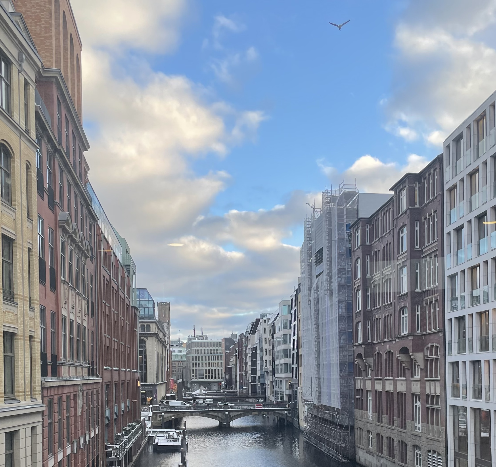
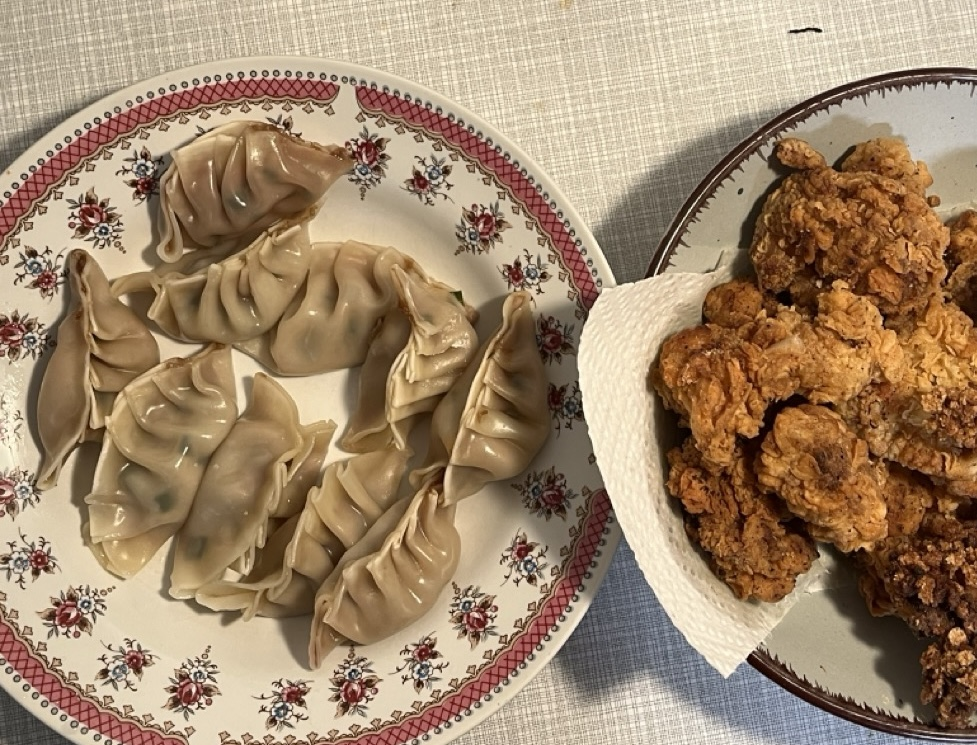

Generally speaking, the beginning of 2024 has been very busy and fulfilling. Apart from not exercising at all and not reading a word book, it is all as expected. I thought that I would be able to get active in the New Year and start reading, but I found an excuse to postpone it until after the exam. ...

## What happened
* **Go to work**: Got my first job to work in a nice office with nice colleagues and really enjoying what I'm working on. Once proved with experience that the industry is a better place for me than the academic. As I feel like I'm actually contributing to something tangible and the time is totally worth it with the  feedback and fulfillment (and of course the money)

* **Got a 4.0**：Just after sighing that the study environment in Germany gives people a sense of comfort when they can fail and start over again, I received the first hang-up in my life. Because I failed to meet the word count requirement for a peer review assignment in one seminar, the doctoral student who taught this course stammered and told me, "I'm sorry, we can't let you pass, it's not fair to the others". The theory of hindsight did reveal that they had an annotated minimum word count, which I should have glanced at when I was writing the assignment, but my brain didn't process the word *minimal* at all... Sort of a not-so-serious lesson. However, I have also reflected on my attitude towards seminar, because there is only a distinction between passing and failing, so it's all about eating the old money and not being very committed to doing it, and now a lot of the opportunities are from previous undergraduates doing the coursework based on their interest and enthusiasm to help me fight for it, so I'd better be serious about doing seminar next semester.

* **A lot of presentations**：At the end of January, I intensively conducted three seminar presentations, and made almost 50 pages of PowerPoint. although I still need notes to help me, but it's not like the first presentation in December when I just read from the notes, I'm getting more and more comfortable of using English. It's true that the more I put my heart into the project, the more I'm able to report it, for example, the best one is the one that I did all by myself.

* **Got two 1.0**：I got perfect scores on the first two ORAL exams and was very happy. However, at first I felt that it was a bit unreal, and I even thought that I would be told later that I was wrongly evaluated and that I would have to take back my grades. After all, the teacher of one of the courses said just before the exam that it was almost impossible to get a 1.0, but he was very happy to congratulate me on getting a perfect score that day. For a moment, I wondered if he had lowered his standards because I was an Asian woman. But that's just a bad habit of doubting yourself before something good happens, and in the end, of course, I accepted the result with confidence.

"Confidence is the realization of one's own promises to oneself," and after looking back at my schedule, I think it's a good thing that I was able to prepare for all three exams at the same time and get at least seven and a half hours of sleep every day, even though I had about 20 hours a week to devote to my job. Quite proud of myself.

* **Cooking**：I tried to make fried chicken, thanks to the cheap and large amount of solid oil in the supermarket, I unlocked fried food. I also unlocked sandwich making, which is better and cheaper than Mensa food. I don't have to have awkward small talk with my classmates in the cafeteria. before, I would alternate one day of pasta and one day of rice, but the frequency of pasta has increased significantly in the past few weeks, because of its convenience and hassle-free nature. I don't cook a lot of stir-fry dishes, but I mainly make a stew with roasted vegetables, and udon noodles go with everything. On New Year's Eve, I used the gyoza skins I bought to make gyoza that I could eat for two weeks, and the best place for chives is in the gyoza.

## Plan Ahead
There are still a few exams to go, but there will still be plenty of free time. The more vague plan is to continue sketching, as well as going to the gym twice a week, being able to read immersively, and swiping through fewer running videos. German will still have to be learned, even though the A1.1 exams are sparse.

    